# nixos-homelab

Declarative homelab on NixOS with K3s. One config file, one command, 20+ self-hosted services.

## What This Does

Turns a single machine into a self-hosted server running everything in Kubernetes. The entire system is declared in Nix: networking, storage, certificates, authentication, backups, and every application. Boot it up, and systemd services deploy everything in the right order. It is idempotent, so re-running is always safe.

## Services

Every service runs as a Kubernetes pod, gets a TLS certificate, and is accessible at `<name>.<subdomain>.<domain>`.

### Media

| Service | URL | What it does |
|---------|-----|-------------|
| [Jellyfin](https://jellyfin.org/) | `jellyfin.*` | Media server. Streams movies, TV, music, and books to any device. |
| [Jellyseerr](https://github.com/Fallenbagel/jellyseerr) | `requests.*` | Request portal. Users request movies or TV shows, and it sends them to the arr-stack. |
| [Sonarr](https://sonarr.tv/) | `sonarr.*` | TV show manager. Monitors series, grabs new episodes, renames and organizes files. Runs two instances (EN + ES). |
| [Radarr](https://radarr.video/) | `radarr.*` | Movie manager. Same as Sonarr but for movies. Two instances (EN + ES). |
| [Lidarr](https://lidarr.audio/) | `lidarr.*` | Music manager. Monitors artists, grabs albums, organizes music library. |
| [Prowlarr](https://prowlarr.com/) | `prowlarr.*` | Indexer manager. Centralizes torrent indexers and pushes them to Sonarr/Radarr/Lidarr. |
| [qBittorrent](https://www.qbittorrent.org/) | `qbit.*` | Torrent client. Downloads everything the arr-stack sends it. |
| [Bazarr](https://www.bazarr.media/) | `bazarr.*` | Subtitle manager. Automatically finds and downloads subtitles for movies and TV. |
| [Bookshelf](https://github.com/linuxserver/docker-readarr) | `books.*` | Ebook manager (Readarr). Monitors authors, grabs books. |
| [Kavita](https://www.kavitareader.com/) | `kavita.*` | Book and manga reader. Web-based reader with OPDS support. |
| [FlareSolverr](https://github.com/FlareSolverr/FlareSolverr) | internal | Cloudflare bypass proxy. Helps Prowlarr access sites behind Cloudflare protection. |
| [Recyclarr](https://recyclarr.dev/) | CronJob | TRaSH Guides sync. Applies recommended quality profiles and custom formats to Sonarr/Radarr. |

All media services are enabled together with `media = true` in config.

### Cloud

| Service | URL | What it does |
|---------|-----|-------------|
| [Nextcloud](https://nextcloud.com/) | `cloud.*` | File storage and sharing. Self-hosted alternative to Google Drive/Dropbox. |
| [Vaultwarden](https://github.com/dani-garcia/vaultwarden) | `vault.*` | Password manager. Bitwarden-compatible server. Stores all service credentials. |
| [Immich](https://immich.app/) | `photos.*` | Photo and video management. Self-hosted alternative to Google Photos with ML-based search. |
| [Syncthing](https://syncthing.net/) | `sync.*` | File synchronization between devices. No cloud, peer-to-peer. |

### Monitoring

| Service | URL | What it does |
|---------|-----|-------------|
| [Grafana](https://grafana.com/) | `grafana.*` | Dashboards and visualization. Shows metrics from Prometheus and logs from Loki. |
| [Prometheus](https://prometheus.io/) | `prometheus.*` | Metrics collection. Scrapes metrics from all services and the cluster itself. |
| [Loki](https://grafana.com/oss/loki/) | internal | Log aggregation. Collects logs from all pods, queryable through Grafana. |
| [Uptime Kuma](https://uptime.kuma.pet/) | `status.*` | Status monitoring. Pings every service and shows a public status page. |

### Knowledge

| Service | URL | What it does |
|---------|-----|-------------|
| [Kiwix](https://www.kiwix.org/) | `wiki.*` | Offline knowledge base. Serves Wikipedia (EN + ES) and iFixit (EN + ES) without internet. ZIM files auto-update weekly. |

### Authentication

| Service | URL | What it does |
|---------|-----|-------------|
| [Authentik](https://goauthentik.io/) | `auth.*` | Identity provider. Single sign-on (OIDC) for all services. Manages users, groups, and access policies. |

### Other

| Service | URL | What it does |
|---------|-----|-------------|
| [Homarr](https://homarr.dev/) | `home.*` | Application dashboard. Start page with links to all services and status indicators. |
| [Restic](https://restic.net/) | timers | Encrypted backups. Daily critical backups and weekly full backups to NAS. |

### Infrastructure (no UI)

These run in the background and have no web interface:

- **K3s** -- Lightweight Kubernetes distribution.
- **MetalLB** -- Assigns IPs to services from a configured pool on your LAN.
- **Traefik** -- Ingress controller. Routes HTTPS traffic to the right service based on hostname.
- **cert-manager** -- Issues and renews a wildcard TLS certificate via Cloudflare DNS challenge.

## Quick Start

### Prerequisites

- A machine (mini PC, server, VM) with x86_64 CPU, 16+ GB RAM, 256+ GB storage
- A domain with Cloudflare DNS
- [Nix](https://nixos.org/download/) installed on your workstation

### Setup

```bash
git clone https://github.com/your-username/nixos-homelab.git
cd nixos-homelab
nix develop

# Interactive wizard: configures network, services, secrets
./scripts/setup.sh

# Install NixOS on the target machine (WARNING: formats disk)
./scripts/install.sh
```

The setup wizard walks through every setting: network, domain, services to enable, NAS storage, credentials, and secrets. It generates `config.nix` and encrypts secrets with [agenix](https://github.com/ryantm/agenix).

You can also set things up manually:

```bash
cp config.example.nix config.nix
cp secrets/secrets.example.nix secrets/secrets.nix
# Edit both files, then encrypt secrets with agenix
```

### Update

After changing `config.nix` or any module:

```bash
./scripts/update.sh
```

## Configuration

All settings live in `config.nix` (see [config.example.nix](config.example.nix) for the full reference).

Toggle services on or off:

```nix
services = {
  authentik = true;    # SSO provider
  vaultwarden = true;  # Password manager
  nextcloud = false;   # File storage
  monitoring = true;   # Grafana + Prometheus + Loki
  media = false;       # Full media stack (Jellyfin + arr-stack)
  immich = false;      # Photo management
  syncthing = false;   # File sync
  dashboard = true;    # Homarr dashboard
  kiwix = false;       # Offline Wikipedia + iFixit
};
```

## VPN (Tailscale)

The server runs [Tailscale](https://tailscale.com/) as a subnet router, giving you access to all services from anywhere without exposing ports to the internet.

### How it works

Tailscale creates a private network (tailnet) between your devices. The server advertises your entire LAN subnet (e.g. `192.168.1.0/24`), so any device on your tailnet can reach local services as if it were on the same network.

### Initial setup

1. Create a [Tailscale account](https://login.tailscale.com/) (free for personal use, up to 100 devices).
2. Generate an auth key: **Settings > Keys > Generate auth key**. Use a reusable key if you want the server to re-authenticate after reboots.
3. Provide the auth key when `./scripts/setup.sh` asks for it, or encrypt it manually:
   ```bash
   agenix -e secrets/tailscale-auth-key.age
   # Paste the key (tskey-auth-...) and save
   ```
4. After the server boots, go to the [Tailscale admin console](https://login.tailscale.com/admin/machines), find your server, and **approve the subnet routes** (Edit route settings > enable the `192.168.x.0/24` route).

### Adding devices

Install Tailscale on any device (phone, laptop, tablet) and sign in with the same account. That's it. The device joins the tailnet and can reach all services through the server's subnet route.

No configuration is needed on the server side when adding new devices.

### DNS (optional)

For `<service>.<subdomain>.<domain>` URLs to resolve over VPN, point your devices to a DNS server that knows about them. Options:

- **Pi-hole / local DNS**: Add a wildcard record `*.<subdomain>.<domain>` pointing to the Traefik IP (the `traefikIP` value in your config).
- **Tailscale MagicDNS**: Configure a custom nameserver in the Tailscale admin console pointing to your local DNS.

## User Management

Users are managed through [Authentik](https://goauthentik.io/), the identity provider. All OIDC-integrated services (Jellyfin, Jellyseerr, Grafana, Nextcloud, Immich, Vaultwarden, Kavita, Homarr, Uptime Kuma) use Authentik for login.

### Adding a new user

1. Open `https://auth.<subdomain>.<domain>` and log in as `akadmin` (password is in the K8s secret `authentik-setup-credentials` in the `authentik` namespace, also stored in Vaultwarden).
2. Go to **Admin Interface > Directory > Users > Create**.
3. Fill in username, display name, email, and password.
4. Assign the user to a group: go to **Directory > Groups**, open the group, go to the **Users** tab, and add the user.

The user can now log in to any OIDC-enabled service with their Authentik credentials.

### Groups

These groups are created automatically during setup:

| Group | Purpose |
|-------|---------|
| `admins` | Full admin access. Admin role in Kavita. |
| `media-admins` | Media service administration. |
| `media-users` | Standard media access. Can stream and request content. |
| `family` | Family members. Same media access as `media-users`. |
| `monitoring` | Access to Grafana, Prometheus, and monitoring tools. |

### What each group gets access to

- **OIDC services** (Jellyfin, Grafana, Immich, etc.): any Authentik user can log in. Group membership controls roles within each service (e.g. `admins` get the Admin role in Kavita).
- **ForwardAuth services** (arr-stack, Traefik dashboard): Authentik intercepts the request and requires authentication. Any valid user can access them.
- **Syncthing**: Uses LDAP (if enabled). Users authenticate with their Authentik credentials via the LDAP outpost.

### Retrieving the admin password

If you forget the Authentik admin password:

```bash
ssh <server-ip>
sudo KUBECONFIG=/etc/rancher/k3s/k3s.yaml kubectl get secret authentik-setup-credentials -n authentik -o jsonpath='{.data.password}' | base64 -d
```

## Storage

Two modes, set in `config.nix`:

- **Local** (`storage.useNFS = false`): Everything stored in `/var/lib/media-data`. No extra hardware needed.
- **NFS** (`storage.useNFS = true`): Mounts from one or more NAS devices. Configure the `nas` section in `config.nix` with IPs, export paths, and per-service paths.

Media services follow the [TRaSH Guides](https://trash-guides.info/) folder structure with hardlinks for efficient storage:

```
/data/
  torrents/{movies,tv,music,books}
  media/{movies,tv,music,books}
```

## Sudo Hardening (optional)

By default, the admin user has passwordless sudo. To require a password for most commands (while keeping `nixos-rebuild`, `systemctl`, `journalctl`, and `kubectl` passwordless):

```bash
# Generate the password hash
mkpasswd -m sha-512

# Encrypt it with agenix
agenix -e secrets/admin-password-hash.age
# Paste the hash and save
```

This is handled automatically if you run `./scripts/setup.sh`. The system detects whether the secret exists and adapts accordingly.

## Architecture

Services deploy in 5 ordered tiers via systemd targets. Each tier completes before the next begins. Solid arrows show explicit service dependencies; dashed arrows show tier ordering.

```mermaid
flowchart TD
    subgraph T0["Pre-K3s"]
        netcheck["network-check"]
        k3s["K3s"]
        kubeconfig["kubeconfig"]
        cnifixer["cni-bridge-fixer"]
    end
    netcheck --> k3s
    k3s --> kubeconfig
    k3s --> cnifixer

    subgraph T1["Tier 1: Infrastructure"]
        metallb["MetalLB"]
        traefik["Traefik"]
        certmgr["cert-manager"]
    end
    k3s --> metallb
    cnifixer --> metallb
    metallb --> traefik --> certmgr

    subgraph T2["Tier 2: Storage"]
        nfs["nfs-storage"]
        cleanup["k8s-cleanup"]
    end
    T1 -.->|target| T2

    subgraph T3["Tier 3: Core"]
        authentik["Authentik<br/>+ PostgreSQL, Redis"]
        monitoring["Monitoring<br/>Prometheus, Grafana, Alertmanager"]
        loki["Loki + Promtail"]
        vaultwarden["Vaultwarden"]
        homarrsetup["Homarr"]
    end
    T2 -.->|target| T3
    monitoring --> loki

    subgraph T4["Tier 4: Media"]
        sso["authentik-sso"]
        arrsecrets["arr-secrets"]
        arrstack["arr-stack<br/>Prowlarr, Sonarr x2, Radarr x2, qBittorrent"]
        jellyfin["Jellyfin"]
        jellyseerr["Jellyseerr"]
        bazarr["Bazarr"]
        lidarr["Lidarr"]
        bookshelf["Bookshelf"]
        kavita["Kavita"]
        flaresolverr["FlareSolverr"]
        nextcloud["Nextcloud<br/>+ PostgreSQL, Redis"]
        recyclarr["Recyclarr"]
    end
    T3 -.->|target| T4
    authentik --> sso
    arrsecrets --> arrstack
    arrstack --> bazarr
    arrstack --> lidarr
    arrsecrets --> lidarr
    arrsecrets --> bookshelf
    arrsecrets --> recyclarr
    jellyfin --> jellyseerr
    sso --> kavita

    subgraph T5["Tier 5: Extras"]
        ldap["LDAP Outpost"]
        nasapps["NAS Apps"]
        arrcreds["arr-credentials"]
        arrdl["download-clients"]
        arrprowlarr["prowlarr-sync"]
        arrfolders["root-folders"]
        arrnaming["naming"]
        lidcfg["lidarr-config"]
        bazcfg["bazarr-config"]
        jfint["jellyfin-integration"]
        jsoidc["jellyseerr-oidc"]
        grafoidc["grafana-oidc"]
        ncoidc["nextcloud-oidc"]
        vwadmin["vaultwarden-admin"]
        vwsso["vaultwarden-sso"]
        vwsync["vaultwarden-sync"]
        immich["Immich<br/>server, ML, PostgreSQL, Redis"]
        immichoauth["immich-oauth"]
        syncthing["Syncthing"]
        kuma["Uptime Kuma"]
        homcfg["homarr-config"]
        nasint["nas-integration"]
        kiwix["Kiwix"]
    end
    T4 -.->|target| T5
    authentik --> ldap
    sso --> nasapps
    sso --> jsoidc
    sso --> grafoidc
    sso --> ncoidc
    sso --> vwsso
    sso --> immichoauth
    sso --> homcfg
    sso --> nasint
    arrstack --> arrcreds
    arrsecrets --> arrcreds
    arrcreds --> arrdl
    arrcreds --> arrprowlarr
    arrcreds --> arrfolders
    arrcreds --> arrnaming
    arrcreds --> lidcfg
    arrcreds --> bazcfg
    arrcreds --> jfint
    arrcreds --> homcfg
    recyclarr --> arrnaming
    recyclarr --> jfint
    arrdl --> jfint
    arrfolders --> lidcfg
    bazarr --> bazcfg
    jellyseerr --> jsoidc
    monitoring --> grafoidc
    nextcloud --> ncoidc
    homarrsetup --> homcfg
    vaultwarden --> vwadmin
    vwadmin --> vwsso
    vwadmin --> vwsync
    immich --> immichoauth
    ldap --> syncthing

    subgraph BK["Backup"]
        bksetup["backup-setup"]
        bkdump["db-dump"]
        bkcrit["critical daily"]
        bkfull["full weekly"]
        bkclean["cleanup weekly"]
    end
    T5 -.->|after| bksetup
    bksetup --> bkdump
    bksetup --> bkcrit
    bksetup --> bkfull
    bksetup --> bkclean
```



**Tiers:**
1. **Infrastructure** -- K3s, MetalLB, Traefik, cert-manager
2. **Storage** -- NFS mounts, PVC setup, namespace cleanup
3. **Core** -- Authentik, Prometheus/Grafana/Alertmanager, Loki, Vaultwarden, Homarr
4. **Media** -- SSO providers, arr-stack, Jellyfin, Jellyseerr, Bazarr, Lidarr, Bookshelf, Kavita, Nextcloud, FlareSolverr, Recyclarr
5. **Extras** -- OIDC/LDAP config, arr config, Immich, Syncthing, Uptime Kuma, Kiwix, NAS integration, credential sync

Backup runs on timers after all tiers: daily critical, weekly full, weekly cleanup.

See [docs/architecture.md](docs/architecture.md) for details.

## Post-Install

Some services need manual configuration after first deploy. See [docs/post-install.md](docs/post-install.md).

## Troubleshooting

See [docs/troubleshooting.md](docs/troubleshooting.md).

## Contributing

See [CONTRIBUTING.md](CONTRIBUTING.md).

## License

[Apache-2.0](LICENSE)
